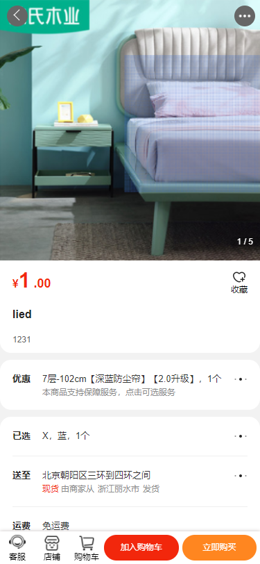
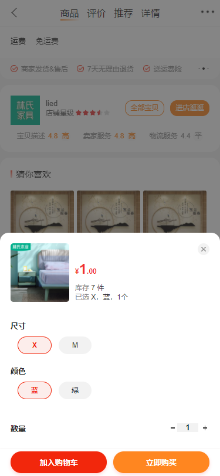
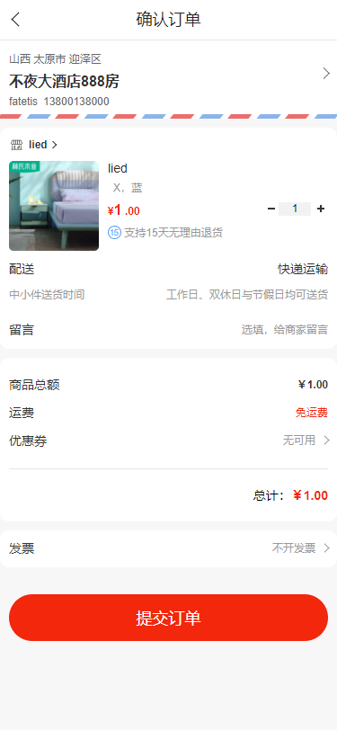
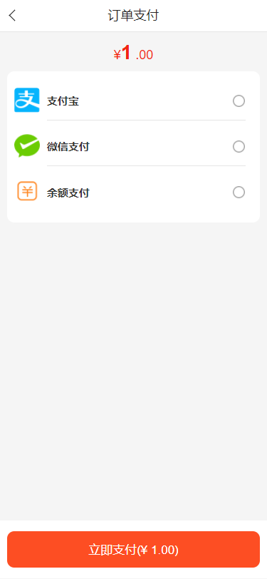
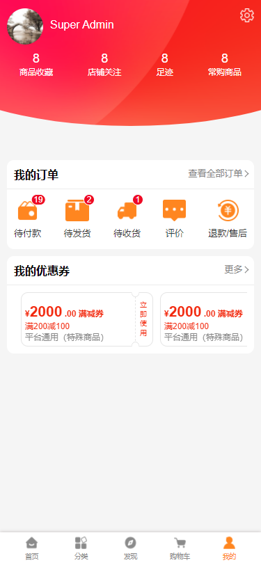
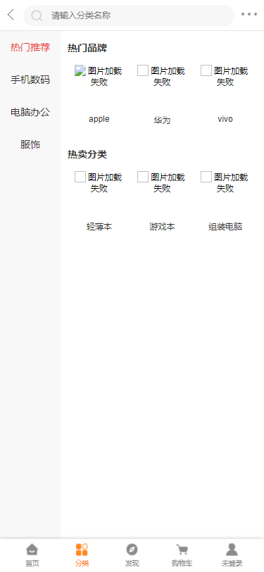

# lied

- 
- 
- 
- 
- 
- 
- 

## 说明
以上是页面的部分截图，需要的话可自行下载哦~~ 照片中有些图片无法加载是因为找不到图片路径，简而言之就是比较随意截出来的。业余时间写的，写的不好地方可在issue评论，我会及时回复。后续会更新优惠券模块的页面~
## Project setup
```
npm install
```

### Compiles and hot-reloads for development
```
npm run serve
```

### Compiles and minifies for production
```
npm run build
```

### Run your unit tests
```
npm run test:unit
```

### Run your end-to-end tests
```
npm run test:e2e
```

### Lints and fixes files
```
npm run lint
```

### Customize configuration
See [Configuration Reference](https://cli.vuejs.org/config/).
